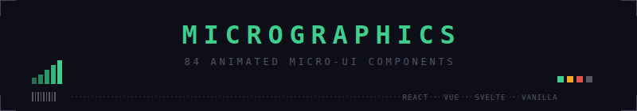
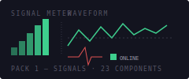
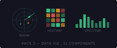
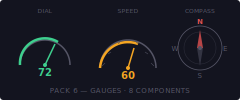
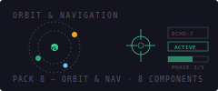
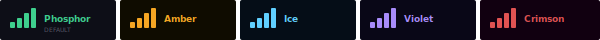

<p align="center">
  
</p>

<p align="center">
  <strong>Dark industrial terminal aesthetic. Pure SVG. CSS custom properties. Zero dependencies.</strong>
</p>

<p align="center">
  <a href="#install">Install</a> ·
  <a href="#components">Components</a> ·
  <a href="#theming">Theming</a> ·
  <a href="#frameworks">Frameworks</a> ·
  <a href="https://micrographics.lemonsqueezy.com">Purchase</a>
</p>

---

## What is Micrographics?

Micrographics is a commercial component library of **84 animated micro-UI elements** — signal meters, gauges, radar displays, terminal text effects, HUD overlays, and more. Every component is:

- **Pure SVG** — pixel-crisp at any size, no canvas or WebGL
- **Themeable** — one CSS variable change recolors everything
- **Tiny** — ~1-3 KB per component, zero runtime dependencies
- **Universal** — React, Vue 3, Svelte 5, and Vanilla Web Components

Built for dashboards, monitoring panels, developer tools, creative portfolios, landing pages, and anywhere you want that retro-terminal industrial look.

---

## Preview

<table>
<tr>
<td align="center">

</td>
<td align="center">

</td>
</tr>
<tr>
<td align="center">

</td>
<td align="center">

</td>
</tr>
</table>

---

## Install

```bash
# React
npm install @micrographics-js/react @micrographics-js/core

# Vue 3
npm install @micrographics-js/vue @micrographics-js/core

# Svelte 5
npm install @micrographics-js/svelte @micrographics-js/core

# Vanilla Web Components
npm install @micrographics-js/vanilla @micrographics-js/core

# Tailwind plugin (free, no token needed)
npm install @micrographics-js/tailwind
```

> Framework packages require a license. See [Purchase](#purchase) below.

### Setup `.npmrc`

After purchasing, create `.npmrc` in your project root:

```ini
@micrographics-js:registry=https://npm.pkg.github.com
//npm.pkg.github.com/:_authToken=YOUR_TOKEN
```

---

## Quick Start

### React

```tsx
import { SignalMeter, PulseTag, DialGauge, RadarSweep } from "@micrographics-js/react";

function Dashboard() {
  return (
    <div style={{ background: "#0d0e17", padding: 24 }}>
      <SignalMeter bars={5} />
      <PulseTag label="ONLINE" />
      <DialGauge value={72} />
      <RadarSweep size={80} />
    </div>
  );
}
```

### Vue 3

```vue
<script setup>
import { SignalMeter, RadarSweep } from "@micrographics-js/vue";
</script>
<template>
  <SignalMeter :bars="5" />
  <RadarSweep :size="80" />
</template>
```

### Svelte 5

```svelte
<script>
import { SignalMeter, RadarSweep } from "@micrographics-js/svelte";
</script>
<SignalMeter bars={5} />
<RadarSweep size={80} />
```

### Vanilla Web Components

```html
<script type="module">import "@micrographics-js/vanilla";</script>
<mg-signal-meter bars="5"></mg-signal-meter>
<mg-radar-sweep size="80"></mg-radar-sweep>
```

---

## Components

**84 components across 8 packs:**

| Pack | Count | Highlights |
|------|-------|-----------|
| **Signals** | 23 | SignalMeter, PulseTag, StatusLight, HeartbeatLine, BatteryMeter, SystemLoad, WatchdogTimer, SignalQuality |
| **Data Viz** | 11 | WaveformLine, RadarSweep, HeatGrid, FrequencyBars, PacketFlow, DotChart, ThermalBar |
| **Text** | 12 | Typewriter, GlitchText, MatrixRain, ScrollingText, KanaTag, MicroStrip, BinaryCounter |
| **Chrome** | 11 | Barcode, CornerOrnament, DataLabel, CoordLabel, RulerTick, WireFrame, HexGrid |
| **Clocks** | 6 | PixelClock, CountdownTimer, StopwatchDisplay, TimezoneBar, UnixTimestamp, DayProgress |
| **Gauges** | 8 | DialGauge, Speedometer, CompassRose, PressureGauge, TankLevel, VoltageDisplay |
| **Interaction** | 5 | ToggleSwitch, NumericStepper, SegmentedBar, CopyButton, RatingDots |
| **Orbit & Nav** | 8 | OrbitSystem, RadarReticle, CrosshairTarget, TargetReticle, MissionStatus |

---

## Theming

One CSS variable changes everything:

```css
:root { --accent: #3ecf8e; }         /* phosphor green (default) */
.danger-zone { --accent: #e05252; }   /* override per-section */
```

<p align="center">
  
</p>

All 84 components respond instantly to CSS variable changes. Per-component `color` prop overrides are also supported:

```tsx
<SignalMeter color="#8b5cf6" />
<DialGauge value={80} color="var(--accent-red)" />
```

---

## Tailwind CSS

```bash
npm install @micrographics-js/tailwind   # free, no token needed
```

```js
// tailwind.config.js
module.exports = {
  presets: [require("@micrographics-js/tailwind/preset")],
};
```

```html
<div class="bg-mg-bg font-mg mg-card">
  <span class="text-mg-accent mg-glow">ACTIVE</span>
  <span class="mg-badge mg-badge-warn">DEGRADED</span>
</div>
```

---

## Frameworks

| Package | Components | Peer Deps |
|---------|-----------|-----------|
| [`@micrographics-js/react`](packages/react) | 84 | React 18+ |
| [`@micrographics-js/vue`](packages/vue) | 84 | Vue 3.3+ |
| [`@micrographics-js/svelte`](packages/svelte) | 84 | Svelte 5+ |
| [`@micrographics-js/vanilla`](packages/vanilla) | 52 | None |
| [`@micrographics-js/core`](packages/core) | Utilities | None |
| [`@micrographics-js/tailwind`](packages/tailwind) | Plugin | Tailwind 3+ |

---

## Architecture

```
packages/
  core/         Shared utilities (RNG, easing, ticker) — free, MIT
  react/        84 React components
  vue/          84 Vue 3 SFC components
  svelte/       84 Svelte 5 components
  vanilla/      52 Web Components (<mg-*> custom elements)
  tailwind/     Tailwind CSS plugin + preset — free, MIT
apps/
  test-app/     Live gallery with theme customizer
```

### Design Principles

- **Pure SVG** — `shapeRendering="crispEdges"`, pixel-perfect at any size
- **CSS Custom Properties** — no hardcoded colors, fully themeable
- **Zero Runtime Deps** — only `@micrographics-js/core` (~5 KB)
- **Monospace First** — designed for JetBrains Mono
- **Subtle Animations** — non-distracting, via `createTicker()`
- **Framework Parity** — identical API across React/Vue/Svelte/Vanilla

---

## Purchase

| Tier | Price | What you get |
|------|-------|-------------|
| Single framework | $79 | All 84 components for React, Vue, Svelte, or Vanilla |
| Full Library | $149 | All 84 components, all 4 frameworks |
| Lifetime | $199 | Everything now + all future components forever |

**Free tier:** `@micrographics-js/core` and `@micrographics-js/tailwind` are MIT licensed and free forever.

[Purchase on LemonSqueezy](https://micrographics.lemonsqueezy.com)

---

## Next.js / App Router

All React components include `"use client"` — zero config needed:

```tsx
import { SignalMeter, PixelClock } from "@micrographics-js/react";
export default function Page() {
  return <div className="bg-mg-bg p-8"><SignalMeter /><PixelClock /></div>;
}
```

---

## Browser Support

Chrome 90+ · Firefox 90+ · Safari 15+ · Edge 90+

---

## Documentation

- [Full API Reference](docs/documentation.md) — all 84 components, props, examples
- [Website Integration](docs/website-integration.md) — embed demos in your site
- [Claude Code Guide](docs/claude-code-guide.md) — prompts for AI-assisted integration
- [Publishing Guide](docs/npm-publishing.md) — how packages are distributed
- [LemonSqueezy Tiers](docs/lemonsqueezy-tiers.md) — pricing structure

---

## License

`@micrographics-js/core` and `@micrographics-js/tailwind` are MIT licensed.

Framework packages (`react`, `vue`, `svelte`, `vanilla`) require a commercial license for production use. Free for personal/non-commercial projects.

[Purchase a license](https://micrographics.lemonsqueezy.com)
